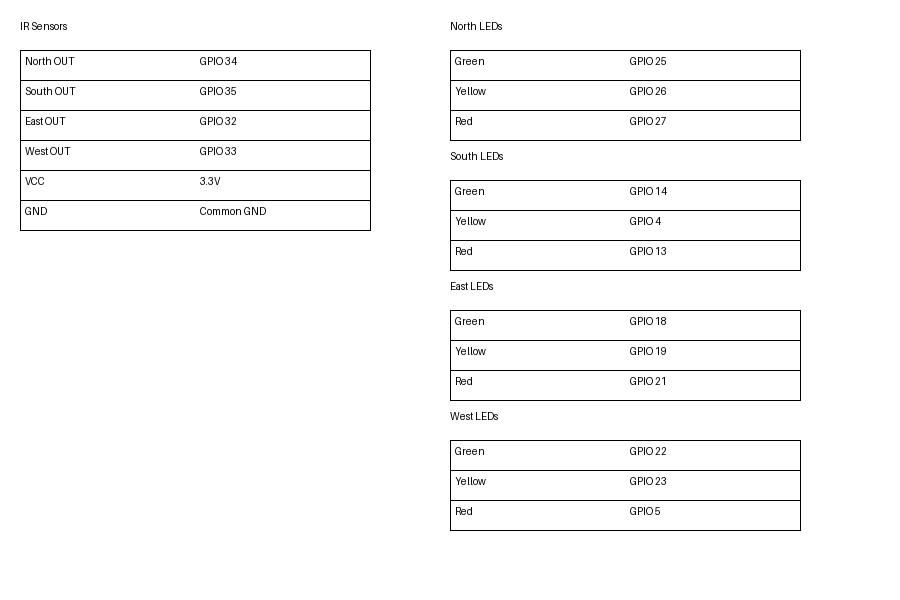

## self-tuning-traffic-system-using-esp32
A real-time traffic control system using ESP32 and IR sensors that dynamically manages signal flow using interrupt-based logic, edge detection, and non-blocking timing.

## Features:
1. Real-time traffic detection using IR sensors  
2. Immediate signal switching using software interrupt logic  
3. Edge detection to prevent repeated triggering  
4. Non-blocking timing using millis()
5. Optimized traffic flow using skip logic

## Components used:
1. ESP32
2. Infrared Sensors (x4)
3. Traffic LED module (x4)
4. Breadboard
5. Jumper Wires

## Connections:
1. Connect the ground on the ESP32 to the top rail of the breadboard.
2. Connect the 3v3 pin on the ESP32 to the bottom rail of the breadboard.
3. Connect the ground and 3v3 pins from these common ground and source.
4. Follow the pin connections.

   
## Pin Connections:

## Software used:
Arduino IDE

## Working Principle:
The system operates in two modes: NORMAL and SMART.

NORMAL Mode:
Signals change in a predefined sequence (North → East → South → West).

SMART Mode:
Triggered when an IR sensor detects a vehicle on any road.

1. IR sensors continuously monitor vehicle presence  
2. When a sensor is triggered, the system checks if that road is already active  
3. If a different road is detected, the current signal is immediately interrupted  
4. The detected road is assigned a green signal  
5. All other roads are set to red

## Work Flow:
        Start
          ↓
   Read Sensor Inputs
          ↓
   Any Sensor Triggered?
       /       \
     No         Yes
     ↓           ↓
Normal Mode   Identify Road
     ↓           ↓
Follow Fixed   Is Same Road Active?
 Sequence        /       \
     ↓         Yes        No
     ↓          ↓          ↓
Continue     Ignore     Interrupt Current
                             ↓
                      Assign Green Signal
                             ↓
                     Set Others to Red
                             ↓
                           Repeat
